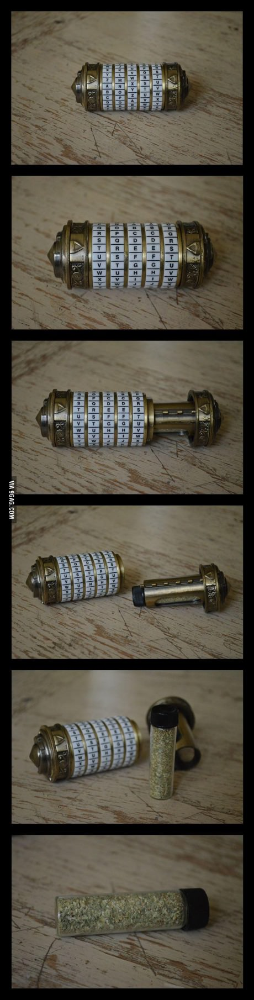
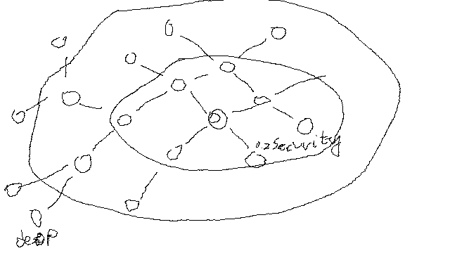
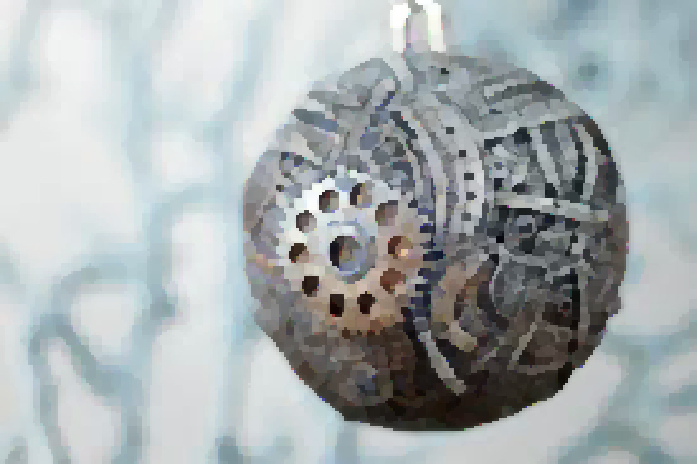
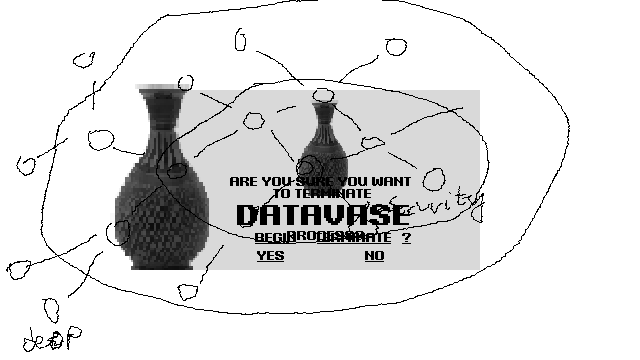

<a name="intro"></a>
# DATAVASE - Cypher Narrative Game
Idea: use Construct 3 Tile-movement behaviour. Left right choses the decryption ring. Up down swaps the symbols.
Idea: the actual datavase is visible since the very beginning from menu (can be interacted with). Once you finish the game you will be able to decrypt the ending code and access the datavase. Added bonus and mystery!












Description.


Description.


### Table of Contents
1. [Introduction.](#intro)
2. [Features.](#features)
3. [Issues.](#issues)
4. [Icebox.](#icebox)
5. [Installation and usage guide.](#install)
6. [Contributing.](#contribute)
7. [License.](#license)
8. [Credits.](#credits)
9. [Commit Glyphs.](#glyphs)

<a name="features"></a>
### Features
+ Feature_01
+ Feature_02
+ Feature_03

<a name="issues"></a>
### Issues
+ Issue_01
+ Issue_02
+ Issue_03

<a name="icebox"></a>
### Icebox
+ Idea_01
+ Idea_02
+ Idea_03

<a name="install"></a>
### Installation and Usage Guide
Include basic necessary components. Gifs if required.
```
1. 
2. 
3. 
```

<a name="contribute"></a>
### Contributing
Insert project contribution rules if allowed.

<a name="license"></a>
### License
Insert project licensing options if there are any.

<a name="credits"></a>
### Credits
Insert project creator entities, contributors and their respective presence links.

<a name="glyphs"></a>
### Commit Glyphs

+ ☰ Code structure and formatting
+ ▲ Performance improvements
+ ⨯ File deletion
+ ∗ Bugfix
+ ⬡ New Feature
+ ⎔ Documentation
+ ❑ UI design
+ ⚑ Release

